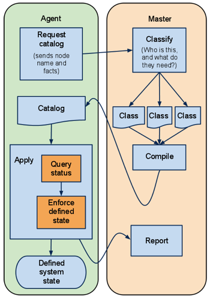

## Assets Report Plugin

简介：本项目是一个Puppet Module，内建了一个Report Processor和一些自定义Facter插件，用来自动采集服务器的资产数据。

## 一、原理

本插件基于Puppet Facter的Report机制。

概念介绍

- [Puppet](https://docs.puppet.com/puppet/4.8/)是一套配置管理工具，是一个Client/Server模式的架构，可以用它来管理软件、配置文件和Service。


- Puppet生态圈里有个叫[Facter](https://docs.puppet.com/facter/)的工具，运行在Agent端，可以和Puppet紧密配合完成数据采集的工作。



如上是Puppet Agent和Master的交互逻辑图。

facter插件运行在Agent端，Agent在发送Request请求Catalog的阶段，会将自身的facts都上报给Master。而Master接到数据后可以利用自身的Report Processor对其进行二次处理，例如转发到别处。

基于该原理，我们开发了自己的Report Processor：`assets_report`，通过HTTP协议将facts post给CMDB，CMDB只需要编写相应的HTTP接口将数据入库。

本包含了如下两个组件来实现整个逻辑

1. assets_report模块：一个纯Puppet Module，内建了一个Report Processor和一些自定义Facter插件，部署在Master端。
   1. Report Processor运行在Master端。
   2. Facter插件会通过Master下发到Agent端并被运行以采集本机资产数据。
2. api_server：负责接收资产数据并将其入库

## 二、采集插件特性

相对于Facter内建的facts，本插件提供了更多的硬件数据，例如

1. CPU个数，型号
2. 内存容量，序列号，厂商，插槽位置
3. 网卡上绑定的ip，掩码，mac，型号，且支持一个网卡上绑定多ip的场景
4. RAID卡个数，型号，内存容量，RAID Level
5. 磁盘个数，容量，序列号，厂商，所属RAID卡，插槽位置
6. 操作系统类型，版本
7. 服务器厂商，SN

高级特性：为了避免大段相同数据重复上报，减轻CMDB的数据库压力，本插件具备Cache功能。即如果一台服务器的资产数据没有发生变更，那么只会汇报`not_modify`标记。

本插件支持的操作系统有(系统必须是64位的，因为本插件中的采集工具是64位的)

1. CentOS-6
2. CentOS-7
3. Windows 2008 R2

本插件支持的服务器有

1. HP
2. DELL
3. CISCO


## 三、采集插件安装方法

> 安装操作在Puppet Master端进行。

因为本插件使用了Facter机制，所以依赖

1. Ruby
2. Puppet
3. Facter

其他工具均自包含在插件里，没有外部依赖。

假定你的Puppet模块目录为`/etc/puppet/modules`

```
cd ~
git clone git@github.com:AutohomeOps/Assets_Report.git
cp -r Assets_Report/assets_report /etc/puppet/modules/
```

在你自己的`puppet.conf`（假设默认路径是`/etc/puppet/puppet.conf`）中添加

```
reports = assets_report
```

然后在site.pp中添加如下配置，让所有Node都安装assets_report模块

```
node default {
  #  include assets_report
  class {'assets_report': }
}
```

配置完毕后，采集工具会被自动下发到Agent上进行安装。下一次Puppet Agent运行时本插件即可正常工作。


## 四、汇报组件配置方法

> 配置操作在Puppet Master端进行。

配置文件为 **assets_report/lib/puppet/reports/report_setting.yaml**

| 参数            | 含义          | 示例                                       |
| ------------- | ----------- | ---------------------------------------- |
| report_url    | 汇报接口地址      | http://localhost/api/v1.0/asset/report/，可修改成你自己的url |
| auth_required | 接口是否包含验证    | true/false，默认为false，验证代码需要在auth.rb中自己实现  |
| user          | 验证用户名       | 如果auth_required为true，需要填写                |
| passwd        | 验证密码        | 如果auth_required为true，需要填写                |
| enable_cache  | 是否启用cache功能 | true/false, 默认为false                     |


## 五、汇报接口配置方法

> 配置操作在Puppet Master端进行。

本接口服务`api_server`基于一个Python编写的Web框架[Django](https://www.djangoproject.com/)开发，该组件包含了数据库设计和http api的实现。因为各家公司的数据库设计均不一致，该项目仅实现了最简单的数据建模，所以该组件的存在仅作为Demo，不可用于生产环境，读者需注意。

首先，我们需要安装一些依赖。这里假定你的OS为CentOS/RedHat

```
$ cd ~/Assets_Report/api_server
安装pip，用它来安装python模块
$ sudo yum install python-pip
安装python模块依赖
$ pip install -r requirements.txt
```

初始化数据库，可以参考 [Django用户手册](https://docs.djangoproject.com/en/1.10/intro/tutorial02/)

```
$ python manage.py makemigrations apis
$ python manage.py migrate
数据库为当前目录下的db.sqlite3
```

启动http api service

```
$ sudo python manage.py runserver 80
服务将监听localhost的80端口。

Django version 1.10.5, using settings 'api_server.settings'
Starting development server at http://127.0.0.1:80/
Quit the server with CONTROL-C.
```

## 

## 六、使用

在Puppet Agent端手动触发

```
puppet agent -t
```

或者 puppet agent的daemon自动运行后，数据采集上报的流程就会触发，上面的api server的80端口就会收到一次post请求，数据库里将会看到本次采集的数据。

```
➜  api_server git:(master) ✗ sqlite3 db.sqlite3
SQLite version 3.14.0 2016-07-26 15:17:14
Enter ".help" for usage hints.
sqlite> .tables
apis_asset                  auth_user_user_permissions
auth_group                  django_admin_log
auth_group_permissions      django_content_type
auth_permission             django_migrations
auth_user                   django_session
auth_user_groups
sqlite> select * from apis_asset;
```


## 七、数据格式详解

    {
      'os_type' # 操作系统类型
      'os_distribution' # 操作系统发行版本
      'os_release' # 操作系统版本号
      'not_modify' # 本次数据跟上次比是否有变更
      'setuptime' # 系统安装时间
      'sn' # 序列号
      'manufactory' # 服务器制造商
      'productname' # 服务器产品名称 
      'model' # 服务器型号
      'cpu_count' # 物理CPU个数
      'cpu_core_count' # CPU逻辑核数
      'cpu_model' # CPU型号
      'nic_count' # 网卡个数
      'nic' # 网卡的详细参数
      'raid_adaptor_count' # raid卡控制器个数
      'raid_adaptor' # raid卡控制器详细参数
      'raid_type' # raid类型
      'physical_disk_driver' # 物理磁盘详细参数
      'ram_size' # 内存总容量
      'ram_slot' # 内存详细参数
      'certname' # Puppet的certname
    }


## 八、开发和贡献

我们非常欢迎大家参与到开发中来，欢迎提交issue，尤其是Pull Request。

## 九、支持和社区

### QQ群

您可以加入我们的官方开源QQ群452994151进行交流。

### Mail

您可以通过autohomeops@autohome.com.cn与我们联系。

### Bug提交

如果您发现任何错误或者有任何建议，请在这里提交
<https://github.com/AutohomeRadar/Assets-Report/issues>

### Wiki
<https://github.com/AutohomeRadar/Assets-Report/wiki>

### 博客

团队官方博客 <http://autohomeops.corpautohome.com>

### License

本软件遵守Apache许可证授权。有关完整的许可证文本，请参阅顶根目录中的LICENSE文件。
